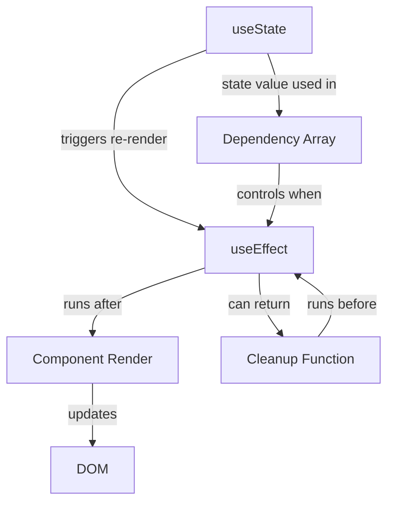
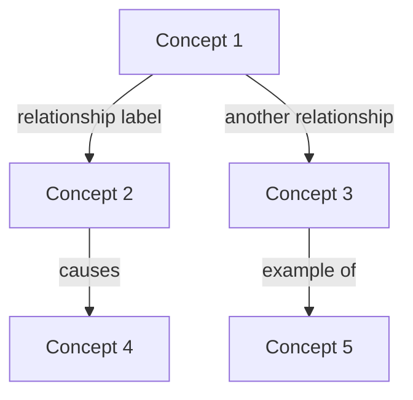

# Apply Encoding Method

**Master**: Dr. Justin Sung
**Core Principle**: "Encoding creates learning. Reviewing doesn't. Build relationships, not flashcards."
**Time**: 80% of study time
**Best For**: Learning anything complex, exam prep, long-term retention

---

## The Core Insight

**Traditional (DOESN'T WORK)**:
1. Read/watch content (10 min)
2. Review flashcards (90 min)
3. Result: Short-term memory, exam brain dump, forget everything

**Encoding Method (WORKS)**:
1. Read/watch content (10 min)
2. Build relationship maps (90 min)
3. Review relationship maps (10 min)
4. Result: Deep understanding, long-term retention, transfer to new contexts

**Key ratio**: 80% encoding, 20% reviewing

---

## When to Use This Skill

✅ **Use when:**
- Learning complex concepts
- Preparing for exams/interviews
- Need long-term retention
- Connecting multiple ideas
- Understanding systems
- Building mental models

❌ **Don't use when:**
- Just memorizing facts (use spaced repetition)
- Very simple information (flashcards are fine)
- Time-pressured cram session (too late, you needed this weeks ago)

---

## The 5-Step Process

### Step 1: Consume Content Quickly (10-20% of time)

**What**: Get the information in your brain (doesn't create learning yet).

**How**:
1. Read chapter / Watch lecture / Attend class
2. Take minimal notes (keywords only)
3. Don't try to memorize
4. Focus on understanding structure

**Speed**: Fast. This is NOT where learning happens.

**Output**: Raw information ingested

**Pitfall**: Spending too much time here
- ❌ Reading and re-reading
- ❌ Highlighting everything
- ❌ Perfect notes
- ✅ Quick pass, move to encoding

---

### Step 2: Identify Key Concepts (5-10 min)

**What**: Extract the main ideas (usually 5-15 concepts per topic).

**How**:
1. List the key terms/concepts
2. Write each on a sticky note or concept card
3. Don't define them yet

**Example - React Hooks**:
- useState
- useEffect
- useContext
- useReducer
- Custom hooks
- Dependency array
- Cleanup function
- Component lifecycle
- Re-rendering
- Side effects

**Output**: List of 5-15 key concepts

**Integration**: Create file `Learning/Active/<skill>/encoding-concepts.md`:
```markdown
# Encoding: [Topic]

## Step 2: Key Concepts
- Concept 1
- Concept 2
- Concept 3
```

---

### Step 3: Build Relationships (60-70% of time) ⭐ CRITICAL

**What**: Connect concepts with LABELED relationships. This is where learning happens.

**How**:
1. Draw concept map (use Mermaid or pen & paper)
2. Connect related concepts with arrows
3. **LABEL EVERY ARROW** (this is critical)
4. Ask: "How do these relate?"

**The Golden Rule**: Every arrow must have a label explaining the relationship.

**Example (BAD - unlabeled)**:
```
useState --> useEffect
```
This creates no encoding. Your brain learns nothing.

**Example (GOOD - labeled)**:
```
useState --"triggers re-render"--> useEffect
useState --"value used in"--> useEffect dependencies
useEffect --"can call"--> useState setter
```
This creates rich encoding. Your brain learns the relationships.

**Mermaid Template**:


**Questions to generate relationships**:
- What causes what?
- What depends on what?
- What's the opposite of this?
- What's an example of this?
- When does this happen?
- Why does this exist?
- What problem does this solve?
- What's similar to this in another domain?

**Output**: Rich relationship map with LABELED connections

**Integration**: Save to `Learning/Active/<skill>/visuals/relationships/[topic]-relationships.md`

---

### Step 4: Identify Higher-Order Relationships (10-20% of time)

**What**: Find patterns, principles, and meta-relationships.

**Higher-Order Relationships**:
- **Category**: "useState and useReducer are both state management hooks"
- **Principle**: "All hooks follow 'Rules of Hooks'"
- **Pattern**: "Hooks with 'use' prefix trigger re-renders"
- **Contrast**: "useEffect = after render, useLayoutEffect = before paint"
- **Hierarchy**: "Custom hooks > Built-in hooks > React internals"
- **Causality**: "State change → Re-render → Effect runs"

**How**:
1. Look at your relationship map
2. Find groups of related concepts
3. Identify patterns across groups
4. Create "hub" concepts connecting multiple areas
5. Add these to your map in different color

**Output**: Higher-order relationships added to map

**Integration**: Update relationship map with higher-order connections:
```markdown
## Higher-Order Relationships

### Patterns Identified
- Pattern 1: [What pattern, which concepts]
- Pattern 2: [What pattern, which concepts]

### Hub Concepts
- Hub 1: [Concept connecting multiple areas]
- Hub 2: [Concept connecting multiple areas]

### Key Principles
- Principle 1: [Overarching rule or principle]
```

---

### Step 5: Review Relationships (5-10% of time)

**What**: Spaced repetition of RELATIONSHIPS, not facts.

**How**:
1. Look at your relationship map
2. Cover parts of it
3. Try to reconstruct relationships
4. Test: "Why does X relate to Y?"
5. Not: "What is X?" (that's lower-order)

**Spaced Repetition Schedule**:
- **Day 1**: Create map (encoding session)
- **Day 2**: Review map (5 min)
- **Day 4**: Review map (5 min)
- **Day 7**: Review map (5 min)
- **Day 14**: Review map (5 min)
- **Day 30**: Review map (5 min)

**During review, ask**:
- Can I explain each relationship?
- Can I reconstruct this map from memory?
- Can I apply this to a new example?

**Output**: Reinforced long-term memory

**Integration**: Log in `progress-journal.md`:
```markdown
## Encoding Review Log

| Date | Topic | Review # | Recall Success | New Insights |
|------|-------|----------|----------------|--------------|
| 2025-11-01 | React Hooks | 1 (Day 2) | 90% | useEffect cleanup pattern |
| 2025-11-03 | React Hooks | 2 (Day 4) | 95% | Can apply to custom hooks |
```

---

## Complete Workflow

### Time Allocation (for 100 min study session)

| Phase | Time | Activity |
|-------|------|----------|
| Consume | 10-20 min | Read/watch content |
| Identify | 5-10 min | List key concepts |
| **Encode** | **60-70 min** | **Build relationship map** |
| Higher-order | 10-20 min | Find patterns, principles |
| Review | 5-10 min | Test relationship recall |

**Total**: Focus ~80% on encoding (steps 3-4), ~20% on consuming + reviewing

---

## Relationship Map Template

Save to `Learning/Active/<skill>/visuals/relationships/[topic]-relationships.md`:

```markdown
# Relationship Map: [Topic]

**Date Created**: [Date]
**Last Reviewed**: [Date]
**Mastery Level**: [1-10]

## Concept Map



## Key Relationships

### Causal (X causes Y)
- Concept A → Concept B: [How A causes B]

### Hierarchical (X is a type of Y)
- Concept C is a type of Concept D

### Sequential (X happens before Y)
- Concept E → Concept F: [In what sequence]

### Comparative (X vs Y)
- Concept G vs Concept H: [How they differ]

## Higher-Order Relationships

### Patterns
- Pattern 1: [What pattern, which concepts show it]

### Principles
- Principle 1: [Overarching rule]

### Hub Concepts
- Hub 1: [Concept connecting multiple areas]

## Application Examples

**Example 1**: [How these relationships apply to real scenario]
**Example 2**: [Another application]

## Review Schedule

- [ ] Day 2 review
- [ ] Day 4 review
- [ ] Day 7 review
- [ ] Day 14 review
- [ ] Day 30 review

## Mastery Test

Can I:
- [ ] Reconstruct this map from memory?
- [ ] Explain every relationship label?
- [ ] Apply this to a new example?
- [ ] Teach this to someone?

---

**Next**: [What to encode next]
```

---

## Advanced Techniques

### Multi-Modal Encoding
Encode same relationships in multiple formats:
1. Mermaid diagram (visual-spatial)
2. Written explanation (verbal-linguistic)
3. Teach someone (social-verbal)
4. Build something using it (kinesthetic)

Each encoding creates different neural pathways.

### Cross-Domain Relationships
Connect new learning to existing knowledge:
- "React hooks are like Vue composition API"
- "useEffect cleanup is like RAII in C++"
- "State management is like database transactions"

### Progressive Encoding
Don't try to map everything at once:
1. **Week 1**: Basic concepts and direct relationships
2. **Week 2**: Add higher-order relationships
3. **Week 3**: Connect to other domains
4. **Week 4**: Refine and simplify map

---

## Common Pitfalls

### ❌ Pitfall 1: Unlabeled Arrows
**Bad**: `useState --> useEffect` (no learning happens)
**Good**: `useState --"triggers re-render that runs"--> useEffect`

### ❌ Pitfall 2: Too Much Time Reviewing, Not Enough Encoding
**Bad**: 10 min encoding, 90 min flashcards
**Good**: 80 min encoding, 20 min reviewing relationships

### ❌ Pitfall 3: Linear Notes Instead of Relationships
**Bad**: "useState creates state. useEffect handles effects."
**Good**: Diagram showing how useState triggers useEffect via re-render

### ❌ Pitfall 4: Memorizing Facts, Not Relationships
**Bad**: "What does useEffect do?" (lower-order question)
**Good**: "How does useEffect relate to the component lifecycle?" (higher-order)

---

## Success Criteria

✅ **You've succeeded when:**
- Can reconstruct relationship map from memory
- Can explain WHY concepts relate, not just THAT they relate
- Can apply relationships to new examples
- Relationships feel intuitive, not memorized
- Can teach the topic using your map
- Remember concepts weeks later without reviewing

❌ **You need more encoding if:**
- Map has unlabeled arrows
- Can't reconstruct map from memory
- Can't explain relationship labels
- Concepts feel like isolated facts
- Need to review constantly
- Forget everything after exam

---

## Integration with Other Skills

**Combine with**:
- `/apply-feynman-technique` - Test if you can explain each relationship simply
- `/apply-focused-diffuse` - Encode in focused mode, let diffuse mode find new connections
- `/apply-pattern-recognition` - Higher-order relationships ARE patterns

**Workflow**:
```bash
1. Read React documentation (20 min)
2. /apply-encoding-method "React Hooks" (80 min)
   → Build relationship map
3. /apply-feynman-technique "Explain useEffect relationships" (30 min)
   → Test understanding
4. Return to relationship map, add clarity
```

---

## Quick Reference

| Study Time | Encoding Time | Review Time | Output |
|------------|---------------|-------------|---------|
| 100 min | 80 min | 20 min | Rich relationship map |
| 50 min | 40 min | 10 min | Core relationships |
| 25 min | 20 min | 5 min | Basic connections |

**Remember**: The map IS the learning. Building it encodes relationships. Reviewing flashcards doesn't create encoding—it only reinforces what's already encoded.

**Focus 80% of your time on building rich, labeled relationship maps. That's where learning happens.**
