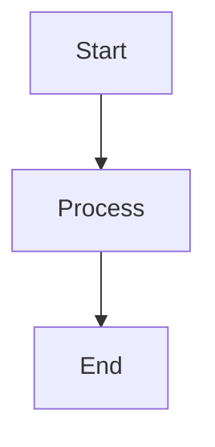
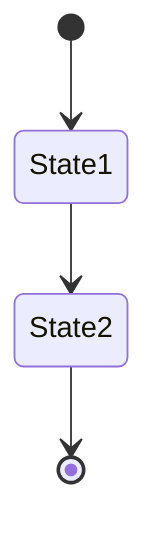
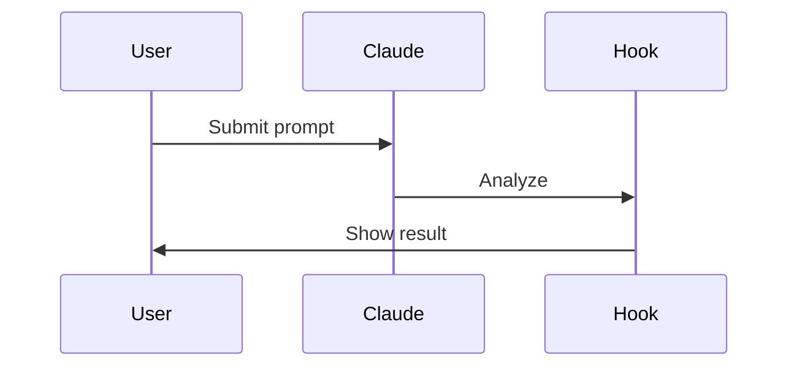
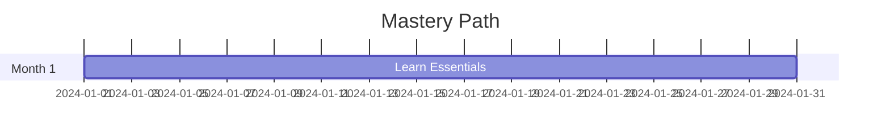
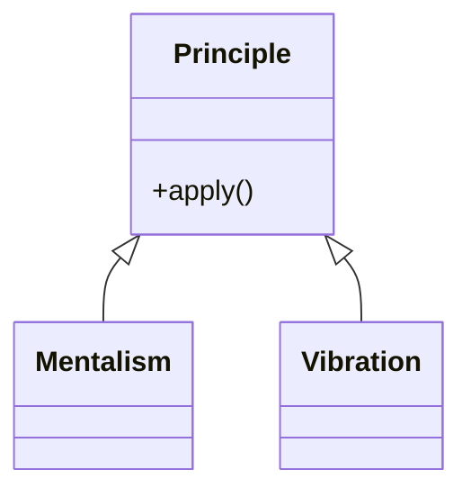
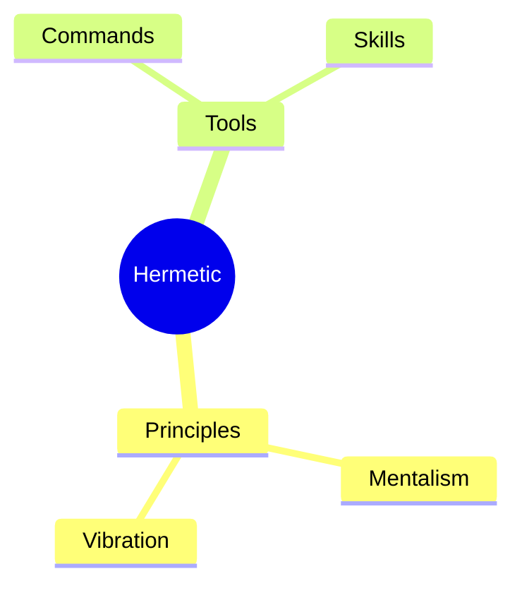

# Hermetic Framework Diagrams

> Visual representations of the Hermetic Consciousness system

---

## What's Here

Professional diagrams for the Hermetic framework, ready to render via MCP servers or online tools.

**Current diagrams:**
- `system-overview.mmd` - Complete system architecture
- `decision-flow.mmd` - From task to shipping
- `economic-tiers.mmd` - 4-tier economic progression

**Planned diagrams:**
- `entry-points.mmd` - Where to start by situation
- `hooks-sequence.mmd` - How hooks create continuous quality
- `mastery-timeline.mmd` - Progressive learning path
- `conflict-resolution.mmd` - Navigate competing principles

---

## How to Render These Diagrams

### Option 1: Via MCP Server (Recommended)

**Prerequisites:**
- Install Mermaid MCP server (see `VISUAL-DIAGRAM-MCP-GUIDE.md`)

**Method 1 - Ask Claude directly:**
```
"Render the diagram in .hermetic/diagrams/system-overview.mmd
as a high-resolution SVG using the mcp-mermaid server"
```

**Method 2 - Using UML-MCP:**
```
"Using UML-MCP, convert system-overview.mmd to both SVG and PNG"
```

**Outputs:**
- `system-overview.svg` (scalable, for web)
- `system-overview.png` (for presentations)
- `system-overview.pdf` (for print, if using mcp-kroki)

---

### Option 2: Mermaid Live Editor (Online)

**Steps:**
1. Go to https://mermaid.live/
2. Copy contents of `.mmd` file
3. Paste into editor
4. Preview renders automatically
5. Export as SVG, PNG, or PDF

**Advantages:**
- No setup required
- Live preview
- Free

**Disadvantages:**
- Manual process
- Can't batch process
- No version control integration

---

### Option 3: VS Code Extension

**Setup:**
1. Install "Markdown Preview Mermaid Support" extension
2. Create a markdown file with Mermaid code block:

````markdown
```mermaid
[paste diagram code here]
```
````

3. Preview markdown (Ctrl+Shift+V)
4. Right-click diagram → Export as SVG/PNG

---

### Option 4: CLI Tool (For Automation)

**Install Mermaid CLI:**
```bash
npm install -g @mermaid-js/mermaid-cli
```

**Render diagrams:**
```bash
# Single diagram
mmdc -i system-overview.mmd -o system-overview.svg

# All diagrams
mmdc -i *.mmd -o ./output/

# With custom theme
mmdc -i system-overview.mmd -o system-overview.svg -t dark

# High-res PNG
mmdc -i system-overview.mmd -o system-overview.png -w 3000 -H 2000
```

**Batch script:**
```bash
#!/bin/bash
# Render all Mermaid diagrams

for file in *.mmd; do
    base=$(basename "$file" .mmd)
    echo "Rendering $base..."
    mmdc -i "$file" -o "$base.svg"
    mmdc -i "$file" -o "$base.png" -w 2400
done

echo "All diagrams rendered!"
```

---

## Customizing Diagrams

### Change Colors

**Edit the theme initialization block:**
```javascript
%%{init: {
  'theme': 'base',
  'themeVariables': {
    'primaryColor': '#YOUR_COLOR',      // Change this
    'secondaryColor': '#YOUR_COLOR',    // And this
    'tertiaryColor': '#YOUR_COLOR'      // And this
  }
}}%%
```

**Hermetic brand colors:**
- Gold: `#FFD700` (principles, core)
- Purple: `#4B0082` (tools, implementation)
- Emerald: `#50C878` (outcomes, success)
- Slate: `#708090` (structure, neutral)
- Dark Red: `#8B0000` (rejection, warnings)

---

### Change Size/Layout

**For flowcharts:**
```mermaid
flowchart TB  %% Top to Bottom
flowchart LR  %% Left to Right
flowchart TD  %% Top Down (same as TB)
flowchart RL  %% Right to Left
```

**For state diagrams:**
```mermaid
stateDiagram-v2
direction LR  %% Or TB for vertical
```

---

### Add Your Own Content

**Copy template:**
```bash
cp system-overview.mmd my-diagram.mmd
```

**Edit structure:**
- Change node labels
- Add/remove connections
- Modify subgraphs
- Adjust styling

**Render:**
```bash
mmdc -i my-diagram.mmd -o my-diagram.svg
```

---

## Diagram Types Available

### Flowchart (system-overview.mmd)
**Best for:** Process flows, hierarchies, system architecture
**Syntax:**


---

### State Diagram (economic-tiers.mmd)
**Best for:** State transitions, lifecycle, progression
**Syntax:**


---

### Sequence Diagram
**Best for:** Interactions, hooks flow, message passing
**Syntax:**


---

### Gantt Chart
**Best for:** Timelines, mastery path, sprint planning
**Syntax:**


---

### Class Diagram
**Best for:** Object relationships, architecture
**Syntax:**


---

### Mindmap
**Best for:** Concept relationships, brainstorming
**Syntax:**


---

## Output Locations

**Source diagrams (editable):**
`.hermetic/diagrams/*.mmd`

**Rendered diagrams:**
- `.hermetic/diagrams/*.svg` (web)
- `.hermetic/diagrams/*.png` (presentations)
- `.hermetic/diagrams/*.pdf` (print)

**In documentation:**
Reference from markdown files:
```markdown

```

**In presentations:**
Import PNG files into PowerPoint/Keynote/Google Slides

**On website:**
Embed SVG files for crisp scaling

---

## Quality Guidelines

### For Web Use
- **Format:** SVG
- **Why:** Scalable, small file size, crisp at any zoom

### For Presentations
- **Format:** PNG
- **Resolution:** 2400x1800 minimum
- **Why:** Compatible with all presentation software

### For Print
- **Format:** PDF
- **Resolution:** 300 DPI
- **Why:** Professional quality, color accurate

### For Documentation
- **Format:** SVG (preferred) or PNG
- **Alt text:** Always provide descriptive alt text
- **Caption:** Explain what diagram shows

---

## Accessibility

**All diagrams should:**
- Use high-contrast colors (already configured)
- Include text labels (not just icons)
- Provide alt text when embedded
- Be understandable in grayscale

**Testing:**
1. Convert to grayscale - still readable?
2. Zoom to 200% - text still clear?
3. Read alt text without seeing image - makes sense?

---

## Version Control

**Commit both source and rendered:**
```bash
git add diagrams/*.mmd      # Source (editable)
git add diagrams/*.svg      # Rendered (viewable)
git commit -m "Add system overview diagram"
```

**Why commit rendered files?**
- GitHub/GitLab display SVG in web UI
- Others can view without rendering
- Faster than regenerating

**Update workflow:**
1. Edit `.mmd` source file
2. Render to `.svg`
3. Commit both
4. Push

---

## Next Steps

**1. Install MCP server**
See `../VISUAL-DIAGRAM-MCP-GUIDE.md` for complete instructions

**2. Render existing diagrams**
```bash
# If using CLI:
cd .hermetic/diagrams
mmdc -i system-overview.mmd -o system-overview.svg
mmdc -i decision-flow.mmd -o decision-flow.svg
mmdc -i economic-tiers.mmd -o economic-tiers.svg
```

**3. Create custom diagrams**
- Copy an existing `.mmd` as template
- Modify for your needs
- Render and view

**4. Update documentation**
- Reference diagrams in markdown
- Add to README.md
- Share in presentations

**5. Generate metrics dashboards**
- Use AntV Charts MCP for data viz
- Create principle scorecard
- Track alignment over time

---

## Common Issues

**"Theme not applying"**
- Make sure `%%{init:...}%%` is on first line
- Check JSON syntax is valid
- Try removing theme, render plain first

**"Diagram too large"**
- Reduce number of nodes
- Use subgraphs to collapse sections
- Split into multiple diagrams

**"Text overlapping"**
- Increase spacing between nodes
- Use shorter labels
- Change layout direction (TB vs LR)

**"Can't export SVG"**
- Check file permissions
- Try different output directory
- Use absolute path

---

## Resources

**Mermaid Documentation:**
https://mermaid.js.org/

**Live Editor:**
https://mermaid.live/

**MCP Setup Guide:**
`../VISUAL-DIAGRAM-MCP-GUIDE.md`

**Hermetic Color Palette:**
See `../brand/vibepack.md`

---

*"Visual clarity serves understanding. Diagrams are maps to truth."*

*— Applied Correspondence: Visual structure mirrors conceptual structure*
